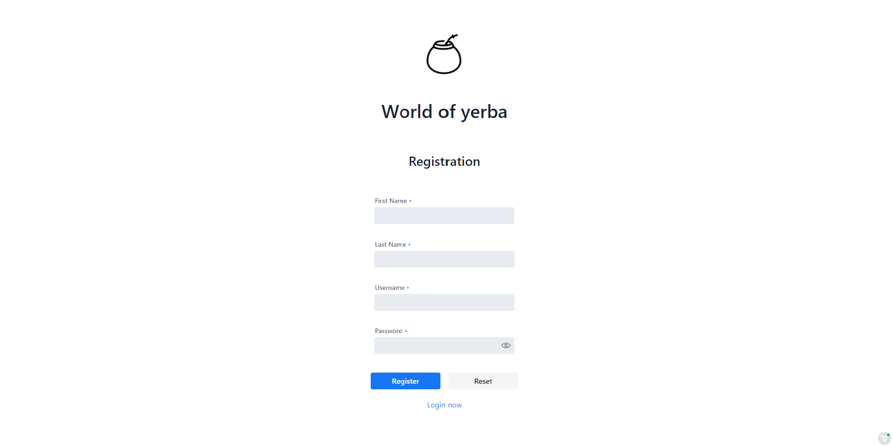

# YerbaVaadinProject
## Example project in Vaadin about yerba

### The application allows you to add yerba to your list and rate it :+1:

**Login form**

**Incorrect login**

**Register form** - User must provide a unique username

**Navbar** - has different elements due to user roles:
1. User:
    - Homepage - information about user
    - MyYerba - own daily newspaper of evaluations yerba
2. Admin:
    - List - CRUD yerba
    - Homepage - information about user
    - MyYerba - own daily newspaper of evaluations yerba

 **Admin view**
 
 
  **User view**
 
 
 **List yerba** - Admin can CRUD yerba
 
 
 **Filter table yerba**
 
 
 **Yerba crud form** - After click row in table the form is automatically completed with the data. Validation is available.
 
 
 
 **User's yerba list** - CRUD
 
 
